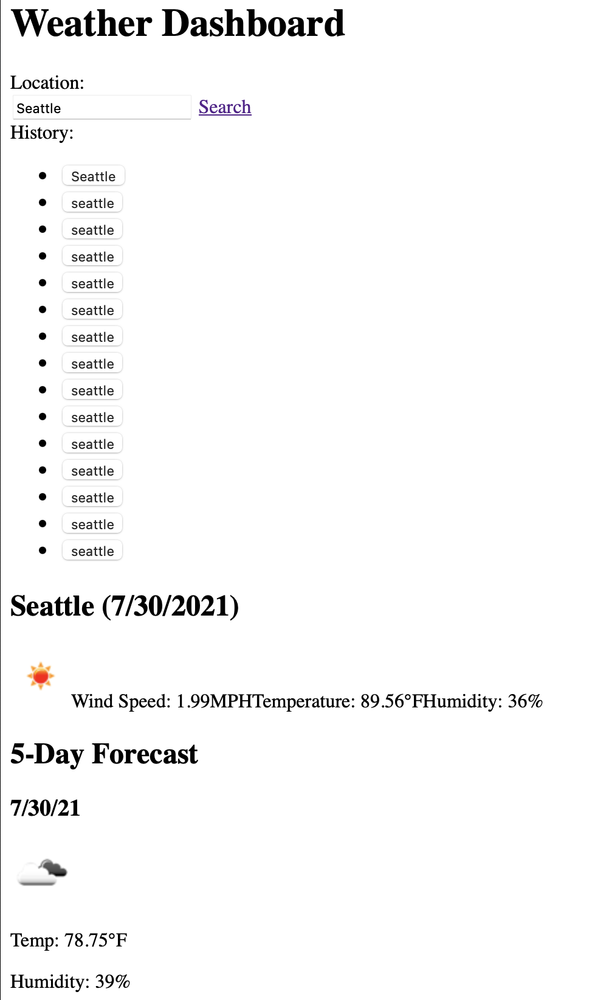

# Weather-Dashboard
</br>
<p align="center">
    <a href="https://developer.mozilla.org/en-US/docs/Web/HTML"></a>
    <a href="https://developer.mozilla.org/en-US/docs/Web/CSS"></a>
    <a href="https://www.javascript.com/"></a>
    <a href="https://getbootstrap.com/"></a>
</p>

## Description
A simple web application that allows users to search for a city to get the current weather and 5 day forecast. Cities that users previously looked up will be saved in their local storage.

## User Story
```
- AS A traveler
- I WANT to see the weather outlook for multiple cities
- SO THAT I can plan a trip accordingly
```

## Functionality

* When searched for a city, the current and future conditions for that city will be presented and that city is added to the search history
  
* When viewing current weather conditions for the city, the following is shown:
  * City name
  * Date
  * An icon representation of weather conditions
  * Temperature
  * Humidity
  * Wind speed
  * UV index
  
* When viewing the UV index, it is presented with a color indicating severity (reference: [Ultraviolet Index Wikipeadia](https://en.wikipedia.org/wiki/Ultraviolet_index#:~:text=A%20UV%20index%20reading%20of,broad%20spectrum%20SPF%2030%2B%20sunscreen.&text=A%20UV%20index%20reading%20of%206%20to%207%20means%20high,harm%20from%20unprotected%20sun%20exposure.))
  *  0-2 Low
  *  3-5 Moderate
  *  6-7 Orange
  *  8-10 Very High
  *  11+ Extreme

## Example

## Deployed Applicaton: https://ctinengyn.github.io/Weather-Dashboard/


## Technologies Used
<p><a href="https://openweathermap.org/">OpenWeather API</a></p>

## Contact
**Email:**
ctine.ngyn@gmail.com

**GitHub:**
[Christine's GitHub](https://github.com/ctinengyn)